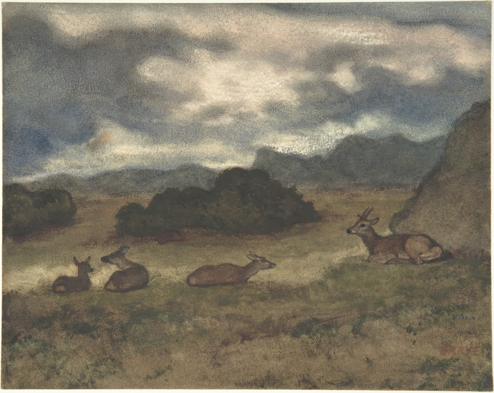

# Recém chegados

No final do primeiro mês do já desastroso governo Bolsonaro, mais um flagrante do vazio democrático que  vivemos em 2019: Jean Wyllys, em entrevista à [Folha](https://www1.folha.uol.com.br/poder/2019/01/com-medo-de-ameacas-jean-wyllys-do-psol-desiste-de-mandato-e-deixa-o-brasil.shtml/), conta que abandonará o cargo no congresso e o país em virtude das ameaças de morte que vem sofrendo.

​	A situação ficou insustentável depois de sucessivas notícias falsas associadas ao deputado: frases normalizando a pedofilia, a propaganda escolar da homossexualidade e outros [absurdos](https://g1.globo.com/fato-ou-fake/noticia/2018/10/02/e-fake-que-jean-wyllys-declarou-que-pretende-criar-lei-para-obrigar-casamento-gay-em-igrejas.ghtml).  Então, o tom agressivo se tornou coisa pública: as pessoas acreditaram nas invenções sobre Jean. Mesmo os cinco casos de injúria e difamação que ganhou não corrigiram da sua imagem a mancha do ataque [sistemático](https://twitter.com/pablo_ortellado/status/1088907193645256706). O  ódio direcionado a ele é incendiado por profissionais, que criam e compartilham mentiras numa fábrica virtual, centralizada em grupos temáticos do Brasil iliberal, e, claro, replicadas no grupo da família.

​	Mas a hostilidade que era virtual é crescentemente concreta. Jean é empurrado e xingado, em público, por agressores justificados por mentiras bizarras. É ameaçado contundente e graficamente. A gravidade dessas escalou depois do assassinato de Marielle Franco em março de 2018, que revelou verdadeiros  e bem orquestrados os planos de calar quem trabalha para democratizar o  Rio, fora do grotesco casamento entre o crime organizado e a corrupção institucional. O medo de Jean é legítimo especialmente quando os milicianos da zona oeste carioca, suspeitos da execução de Marielle, parecem num movimento nacional, e talvez tenham [acesso](https://brasil.elpais.com/brasil/2019/01/22/politica/1548165508_401944.html) á presidência.  No vácuo, o cheiro do esgoto volta.

​	Jean vai para o exílio, perseguido politico. Mas o trabalho continua com David Miranda, negro gay e favelado no congresso nacional. Eu continuo, do Butantã e via internet. O movimento LGBT, o feminismo, a luta antiracista e a oposição  de esquerda também são materiais. Eu mesmo não vou a lugar nenhum. E  pergunto: Quem matou Marielle e Anderson? Quem ameaça Jean e Freixo? De  onde vem os planos de difamação, coerção e execução dos nossos  representantes?

## Para curar fake news, o bom jornalismo brasileiro

- Malu Gaspar ás quintas no [Foro de Teresina](https://piaui.folha.uol.com.br/radio-piaui/foro-de-teresina/), podcast da revista Piauí
- Renata Lo Prete diariamente, no [Jornal da Globo](https://globoplay.globo.com/jornal-da-globo/p/817/)
- Carol Pires na Piauí: [ A dinastia de Tieta](https://piaui.folha.uol.com.br/materia/dinastia-de-tieta/)

## Tiranos têm alergia ao pensamento

- Judith Butler em Chronicle of Higher Education: [The Criminalization of Knowledge](https://www.chronicle.com/article/The-Criminalization-of/243501)
- Shona McCombes em Popula: [The university at the end of the world](https://popula.com/2019/01/03/the-university-at-the-end-of-the-world/)
- Benjamin Moser na Folha de São Paulo: [Imagem externa do Brasil mudou para pior no novo governo](https://www1.folha.uol.com.br/ilustrissima/2019/01/imagem-externa-do-brasil-mudou-para-pior-no-novo-governo-diz-benjamin-moser.shtml)

## A complexa construção do masculino

- Juliana de Albuquerque na Folha de São Paulo: [Como o mal-estar na identidade masculina molda a política](https://www1.folha.uol.com.br/ilustrissima/2019/01/como-o-mal-estar-na-identidade-masculina-molda-a-politica-dos-nossos-tempos.shtml)
- James Kirchick em New York Review of Books: [A Thing for Men in Uniforms](https://www.nybooks.com/daily/2018/05/14/a-thing-for-men-in-uniforms//)

​      

## Minha própria elaboração

- Rich Juzwiak no New York Times: [The Defiance of Mariah's Lambs](https://www.nytimes.com/2018/12/22/style/mariah-carey-in-concert.html/)
- Mario Mieli em The New Inquiry: [A Gay Communist Manifesto](https://thenewinquiry.com/a-gay-communist-manifesto/)
- Tiago Dias na Folha de São Paulo: [Plataforma nacional e grátis lança hits do verão e desbanca Spotify no Nordeste](https://www.e-flux.com/architecture/dimensions-of-citizenship/178279/effortless-slippage/)
